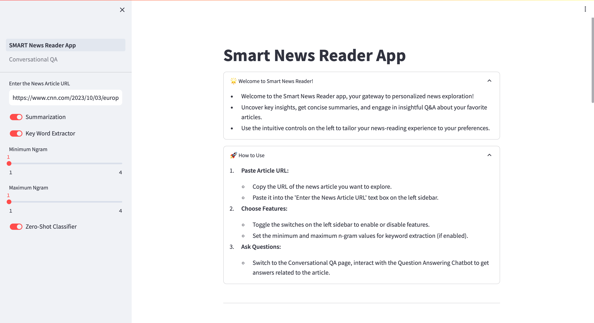
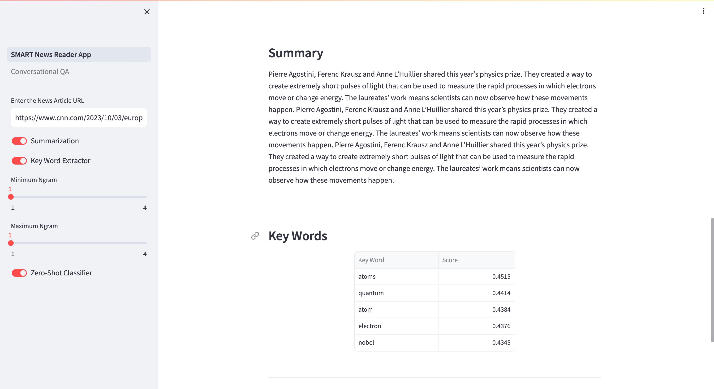
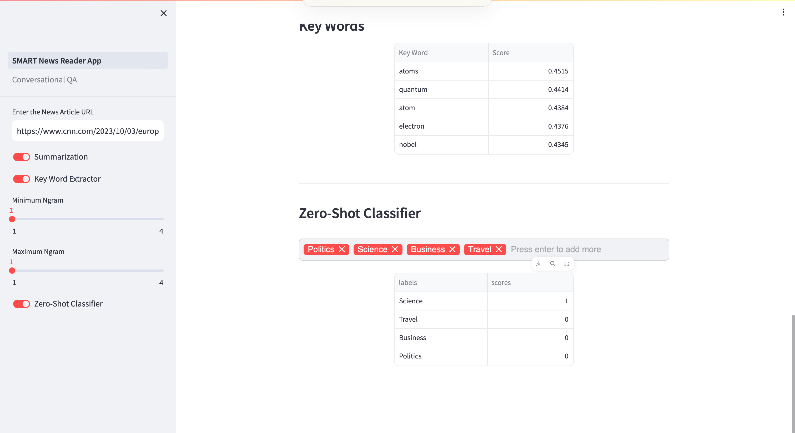

# AI News Reader

An interactive news reader application powered by NLP techniques for personalized and streamlined news exploration.

Here is a description of the features:

## Features

- **News Parsing**: 
  - Uses Newspaper3k package to extract key information from news articles given just the URL
  - Extracts text body, images, authors, publish date, etc.
  - Handles variety of news websites without needing separate scrapers for each

- **Summarization**:
  - Generates concise summaries of news articles using BART-Large-CNN model
  - Pretrained on CNN news dataset, so works well for news content 
  - Splits long articles into chunks to handle max token limits of model and combines summaries of chunks to retain context
  - Allows adjustable summary length
  
- **Zero-Shot Classification**:
  - Categorizes news articles into relevant topics without needing specific training data
  - Leverages BART-Large-MNLI fine-tuned on CNN articles
  - Accepts user-defined topics/labels to classify articles
  - Useful for personalized news curation
  
- **Keyword Extraction**: 
  - Identifies keyphrases and concepts from articles using KeyBERT
  - Uses BERT word embeddings and cosine similarity to extract keywords
  - Does not just pick frequent words, but ones representative of the context
  
- **Conversational QA**:
  - Allows users to ask questions about articles and have a dialogue
  - Implements Llama-2-13B-chat model for conversational capabilities
  - Question Answering RAG using LangChain
  - Uses chat history for context to improve conversational flow
  - Ability to show user the article text used to answer their question
  - Handles clarification questions and followup queries

## App Demo

## Getting Started

- Clone the repository
- Install dependencies
- Download and add the required NLP models 
- Run `streamlit run app.py` to start the app

## Built With

- [Streamlit](https://streamlit.io/) - For the web interface
- [Newspaper3K](https://newspaper.readthedocs.io/) - For news parsing
- [Transformers](https://huggingface.co/models) - For NLP models like BART, BERT
- [KeyBERT](https://maartengr.github.io/KeyBERT/) - For keyword extraction
- [LangChain](https://langchain.readthedocs.io/) - For conversational QA and text chunking

## Contributors

- Arjun Bingly 
- HaeLee Kim
- Nayaeun Kwon
